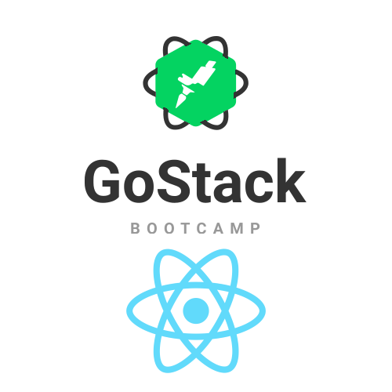

<h1 align="center">
  
</h1>

<h3 align="center">
  Desafio Bootcamp Rocketseat: Fundamentos ReactJS, nesse desafio, foi criado uma aplicação para treinar o que aprendi até agora no ReactJS!
  <br>
  Nesse desafio, foi desenvolvido a aplicação de gestão de transações, a GoFinances. Nela foi praticado o que aprendi até agora no React.js junto com TypeScript, utilizando rotas e envio de arquivos csv por formulário.
</h3>

<!-- <p align="center">See in action: <a href="#">click here</a></p> -->

<p align="center">
  

  

  <a href="https://github.com/lcoalves">
    
  </a>

  <a href="https://github.com/lcoalves/fundamentos-reactjs/stargazers">
    
  </a>
</p>

## Getting Started

These instructions will get you a copy of the project up and running on your local machine for development and testing purposes. See deployment for notes on how to deploy the project on a live system.

### Prerequisites
- [NodeJS](https://nodejs.org/en/) - Environment runtime
- [Yarn](https://yarnpkg.com/getting-started/install) - Packager manager

What things you need to install the software and how to install them

```
$> git clone https://github.com/lcoalves/fundamentos-reactjs.git
```

### Installing

A step by step series of examples that tell you how to get a development env running

#### Databases
First install front-end dependencies
```
$> cd fundamentos-reactjs && yarn
```
Next open the code
```
$> code .
```

#### Front-end
Start front-end service
```
$> yarn start
```

#### Front-end (Running TESTS)
Run
```
$> yarn test
```

## Built With

* [React](https://reactjs.org/docs/getting-started.html) - A JavaScript library for building user interfaces
* [Jest](https://jestjs.io/docs/en/getting-started) - Jest is a delightful JavaScript Testing Framework with a focus on simplicity.

## Authors

* **Lucas Alves** - *Full Stack Developer* - [GitHub profile](https://github.com/lcoalves)

## License

This project is licensed under the MIT License - see the [LICENSE.md](https://github.com/lcoalves/fundamentos-reactjs/blob/master/LICENSE) file for details

## Acknowledgments

* React
* Typescript
* Jest
